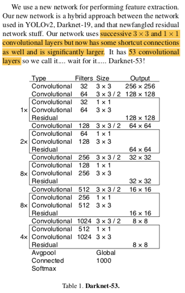

# Darknet #
Darknet is an open source neural network framework written in C and CUDA. It is fast, easy to install, and supports CPU and GPU computation.

For more information see the [Darknet project website](http://pjreddie.com/darknet).

For questions or issues please use the [Google Group](https://groups.google.com/forum/#!forum/darknet).

# YOLOv3 Notes and Code Review

The author documents quite well how to use YOLOv3 here https://pjreddie.com/darknet/yolo/.
Darknet is his own equivalent to TensorFlow or Pytorch written completely
in C with no dependencies (CUDA is optional). I’m amazed that (1) one
person was able to do this and (2) the code is as simple and beautiful as
it is. Some of the code is difficult to read, but the overall structure is
very clear.

The common neural network operations each have their own .c file in the
`/src` directory e.g. connected_layer.c and convolutional_layer.c. The
general structure of the codebase is that the “library” part of Darknet
that contains common neural network operations is in `/src` and the
“applications” part of Darknet that contains different specific uses of
the core library is in `/examples`. The different applications are the
YOLO detector and the author’s other neural network projects.
1. The `main()` method for Darknet is in `examples/darknet.c` [link](https://github.com/pjreddie/darknet/blob/f6d861736038da22c9eb0739dca84003c5a5e275/examples/darknet.c#L403)

	a. `main()` contains the functions calls for each of the command
	line options explained in the YOLO website: *detect*, *detector test*,
	*detector demo*, and *detector train*.

	b. We will pursue *detector train* because it should execute the meat of
	the YOLO paper. If the `main()` function is passed the word *detector*
	it calls the `run_detector(int argc, char **argv)` function.

	c. `run_detector(int argc, char **argv)` is defined in `examples/detector.c` [link](https://github.com/pjreddie/darknet/blob/f6d861736038da22c9eb0739dca84003c5a5e275/examples/detector.c#L794)
    This function calls many instances of `find_char_arg(int argc, char **argv, char *arg, char *def)`
    defined in `src/utils.c`. `find_char_arg()` searches command line arguments
    for expected char sequences such as *-prefix* and returns the argument values.

    d. After parsing command line arguments, `run_detector()` will call
    `train_detector()` if the *train* argument is given. The important
    arguments for this function are (1) the location of the data configuration
    file e.g. *cfg/voc.data* which contains training and validation labels
    and (2) the network configuration file e.g *cfg/yolov3-voc.cfg* which
    contains the definition of the network architecture.
2. The training operation for YOLOv3 is in `train_detector(char *datacfg, char *cfgfile, char *weightfile, int *gpus, int ngpus, int clear)`
   [link](https://github.com/pjreddie/darknet/blob/f6d861736038da22c9eb0739dca84003c5a5e275/examples/detector.c#L6)

   a. `read_data_cfg(char *filename)` in `src/option_list.c` parses the
   data configuration file. Options read from this configuration file
   are stored in a linked list and parsed by `option_find_str()` defined
   in `src/option_list.c`.

   b. The following commonly used "classes" (there are no classes in C) appear
   in `train_detector()` and are defined in `include/darknet.h`: A *network* is
   a struct containing dozens of parameters such as *learning rate* and
   *momentum*. A *matrix* is a struct that contains height and width and
   a pointer to cell contents. A *data* object is a struct containing x
   and y *matrices*. A *layer* is a massive struct containing hundreds of
   parameters such as *nbiases*, *nweights*, and *inputs*.

   c. An array of networks is allocated using calloc() based on the
   number of GPUs available. For every available gpu, `load_network()`
   is called to convert the network definition in the configuration file
   into a network in memory. The core heavy lifting inside `load_network()` is
   `network *parse_network_cfg(char *filename)` in `src/parser.c`. It's worth
   looking at `cfg/yolov3-voc.cfg` to compare the network definition in that
   configuration file to the network definition in the YOLOv3 paper shown
   below:
   
